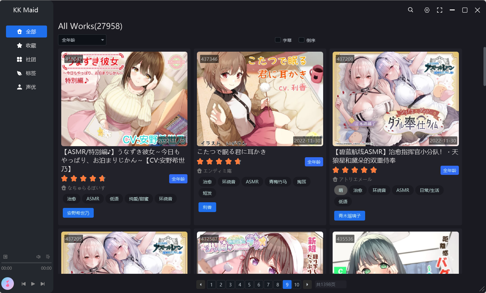
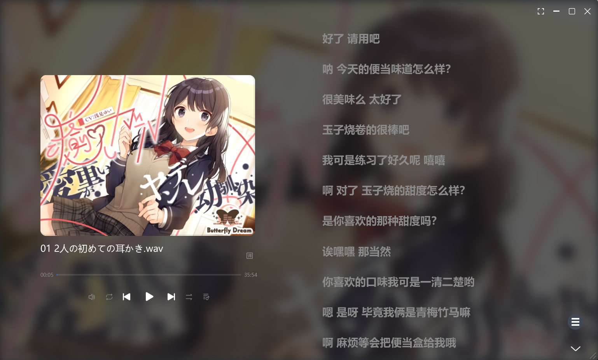
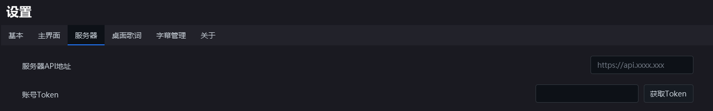
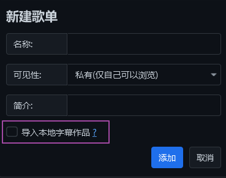

**本项目是作者学习JavaFX的练手项目，仅供学习交流使用，请勿进行推广与搬运，谢谢。**

# 一、说明

未来道具11号-KK Maid是一款适配ASMR ONE的桌面级客户端，使用JavaFX进行开发。主要解决在使用Web应用的痛点问题，如不够灵活的桌面歌词，繁琐的下载，手里成千上万的字幕包却无法可视化查看等等。

目前实现的功能有：

- 基本的功能，包括作品浏览，收藏，播放，LRC与VTT支持；
- 歌单的创建与管理；
- 更美观的播放界面，控制，滚动歌词统统有；
- 更便捷的在线图片浏览，图片切换，放大缩小，一键保存；
- 更好的桌面歌词，透明，自定义颜色，锁定，我全都要；
- 更强大的本地字幕支持（ZIP字幕包与字幕文件夹），播放在线作品可以使用本地字幕；
- 更贴心的功能，本地字幕包在线可视化匹配，有图有真相；
- 更强大的字幕查看，一个窗口查看所有字幕；
- 更便捷的作品下载（需要配置Motrix）；
- 更详细黑名单支持，包括作品黑名单，标签黑名单，字幕文本黑名单。




# 二、使用教程
### 请记住：未来道具11号不是一款商业软件，没有精力去考虑与处理方方面面的异常。开发者的设计理念一直是在约定的范围内合理使用，则有着良好的体验。
#### 1. 配置服务器和Token
程序使用需要配置服务器地址和Token。首次使用，请前往 **设置-服务器** 设置服务器地址以及Token。

**如果你无法直接访问网站，先设置代理并重启。**


> **请严格按照格式来填写，不要多一个字符**

服务器API ： 假设服务器地址是https://baidu.com，那么输入框填写的Api地址是https://api.baidu.com，具体请前往网站查询具体服务器地址。 

Token: 傻瓜式操作，点击获取Token登录即可。

配置完上面两项就可以愉快使用了。

#### 2. 配置本地字幕

> 注意：本地字幕目前只支持LRC格式，字幕压缩包只支持ZIP格式

如果你需要使用本地字幕，前往 **设置-字幕管理** 进行配置。

目前程序支持两种字幕导入方式，分别是**字幕根文件夹**以及**字幕压缩包文件夹**。请优先使用**字幕压缩包文件夹**方式，字幕根文件夹未来不再支持。

##### 本地字幕根文件夹：这个是所有字幕文件夹的根文件夹，里面放置的的是每个音声的字幕文件夹。请注意暂不支持子字幕文件夹的查找与读取。

##### 本地压缩包文件夹：里面放的是所有zip格式的字幕压缩包。请注意暂不支持子字幕文件夹的查找与读取

```
字幕根文件夹的格式如下：
-根目录
	--作品1
		---字幕01.lrc
		---字幕01.lrc
	--作品2
		---字幕01.lrc
		---字幕01.lrc
		
字幕压缩包文件夹的格式如下：
-根目录
	--作品1.zip
	--作品2.zip
```

#### 3. 将本地字幕进行可视化浏览

本地字幕包如何选取自己喜欢的作品是一大麻烦事，毕竟没图没真相。

本程序通过歌单的方式实现了本地字幕的可视化浏览，即像浏览在线作品一样浏览本地字幕对应的作品。

首先，配置好本地字幕；然后前往歌单界面，点击右上角创建新的歌单，**勾选导入本地字幕作品**，完成添加。这样就可以在新创建的歌单中查看本地字幕对应的作品了。




> 注意：对于网站上没有的作品，不会显示。

#### 4. 下载作品到本地

程序不内置下载程序，通过Aira2的适配进行下载（开发者推荐使用[Motrix](https://motrix.app/)），速度会有所保证。如果你对Aira2不了解，请善用搜索引擎。

使用前需要前往**设置-下载**完成配置，设置下载目标文件夹，Aira2的地址以及Aira2的PRC密钥。

# 三、问题与解答
#### 关于字幕文件相关，乱码问题
KK Maid只支持UTF-8格式的LRC字幕文件，非UTF-8格式的字幕无法正常读取，会产生乱码文字，倘若其他格式请使用其他编辑器更改。
如果在使用本地Zip字幕包时，字幕标题乱码，这是因为字幕包的打包环境编码格式导致的。例如MAC打包在Windows中读取会导致标题乱码，因为MAC的默认编码是UTF-8，而Windows默认编码是GBK。解决方法是手动重新打包,当然这并不影响字幕文本。

#### 字幕文件与当前播放并不配对问题
由于各种字幕标准不一，有的字幕名称是日文，有的是中文等其他语言，有的有特典字幕，有的没有特典字幕，自然难以保证百分百配对。当然KK Maid提供解决方法。你可以在播放界面，选择字幕管理功能，对不匹配的字幕进行手动适配。
# 四、感谢以下开源项目

1. [JFoenix](https://github.com/sshahine/JFoenix)
2. [FXTrayIcon](https://github.com/dustinkredmond/FXTrayIcon)
3. [ControlsFX](https://github.com/controlsfx/controlsfx)
4. [Jackson](https://github.com/FasterXML/jackson)
5. [Atlantafx](https://github.com/mkpaz/atlantafx)
6. [Openjfx](https://openjfx.io/)
7. [Zip4j](https://github.com/srikanth-lingala/zip4j)
8. [EventBus](https://github.com/greenrobot/EventBus)

# 五、如果该开源项目对您的学习有所帮助，欢迎赞助支持。

您可以按照以下格式留言：

**KK Maid @[称呼]：[想说的话]**


